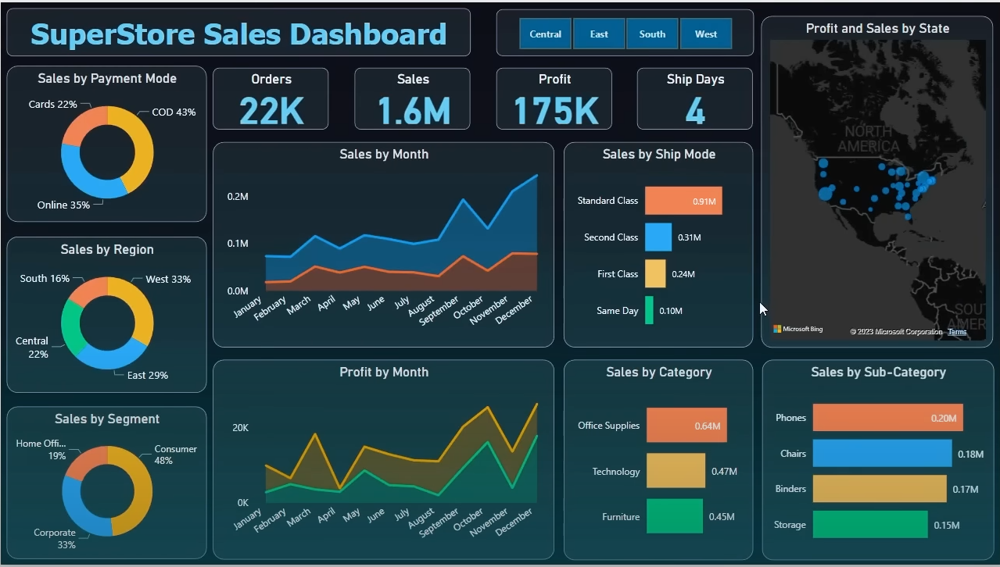
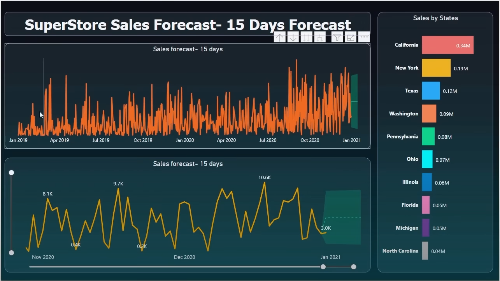

# Power BI Sales Dashboard Project

This repository contains a comprehensive Power BI Sales Dashboard project that provides interactive and insightful visualizations to analyze sales performance. The dashboard aims to help users understand key metrics, identify trends, and make data-driven business decisions.

## Project Overview

The Sales Dashboard enables an in-depth analysis of the sales dataset with features like filtering, drill-downs, and multiple visualization types. The project includes well-structured data, calculated measures, and interactive elements for a complete analytical experience.

## 📊 Dashboard Preview

## Objectives

- Visualize sales performance using interactive charts and KPIs
- Detect key sales trends over time
- Identify top-performing regions, categories, and products
- Enable dynamic filtering and segmentation of sales data
- Provide actionable insights to boost business strategy

## Features

- Summary cards for total sales, quantity sold, profit, and other KPIs
- Trend charts for monthly and yearly sales analysis
- Bar and column charts comparing product categories, customer segments, and    regions
- Pie/donut charts for categorical break-downs
- Slicers and filters for interactive data exploration
- Sales forecasting using built-in Power BI tools
- Table visualizations for detailed record-level insights

## Technologies Used

- **Power BI Desktop** for dashboard creation, visualization, and analysis
- **Power Query** for data cleaning and preparation
- **DAX (Data Analysis Expressions)** for calculated columns and custom measures

## Key Insights

- Identification of sales growth and seasonal patterns
- Discovery of best and worst performing products and regions
- Insights on customer segments and sales channels
- Forecasting of future sales trends based on historical data

